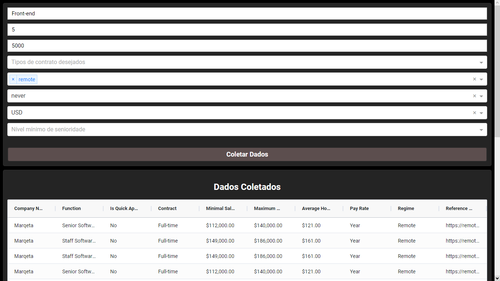
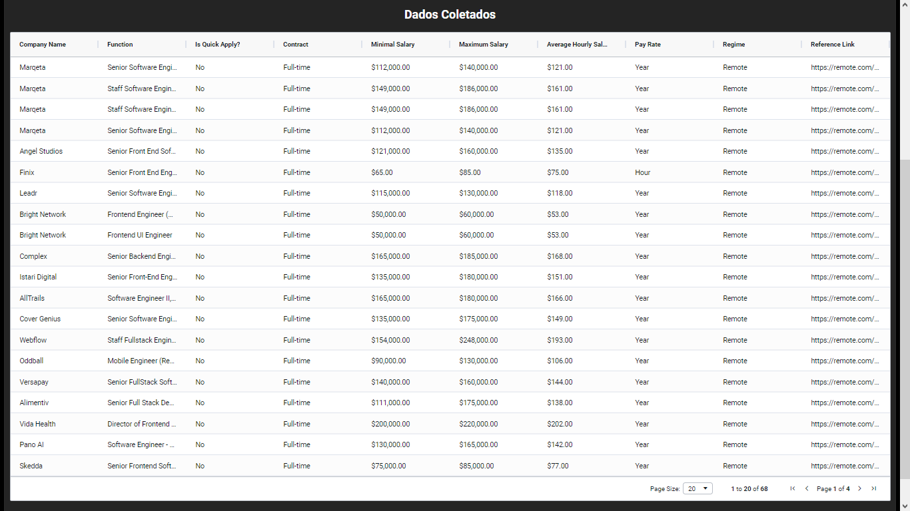
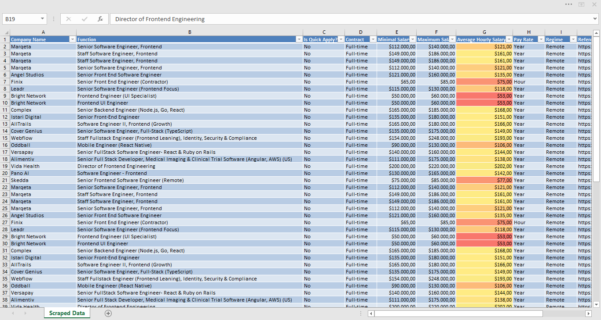

# 💼 Job Scraper with personalized filters (Remote.com)

A job vacancy web-scraper, built with **BeautifulSoup**, **Pandas** and **Dash**, that scrapes [Remote.com](https://remote.com/jobs/all) based on personalized filters.

---

## Funcionalities

- 📄 Scrapes Remote.com data
- 🔍 Search filters:
  - Contract type (Full-time, Part-time, Contract)
  - Workplace (Remote, Hybrid, On-site)
  - Minimal seniority
  - Currency and minimal salary
  - Key-words
  - Travel frequency
- 💰 Calculates hourly average
- 📥 Exports data in **EXCEL**

---

## Libraries used

- [Python 3.10+](https://www.python.org/)
- [BeautifulSoup4](https://www.crummy.com/software/BeautifulSoup/)
- [Pandas](https://pandas.pydata.org/)
- [Dash](https://dash.plotly.com/)
- [Requests](https://docs.python-requests.org/)

---

## Screenshot

